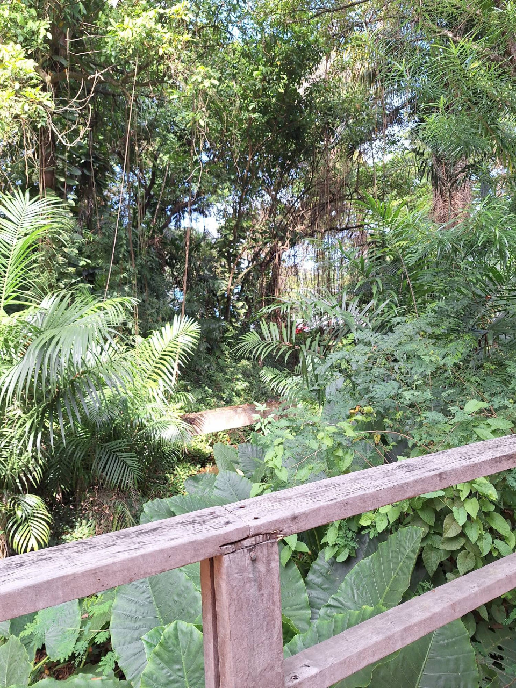
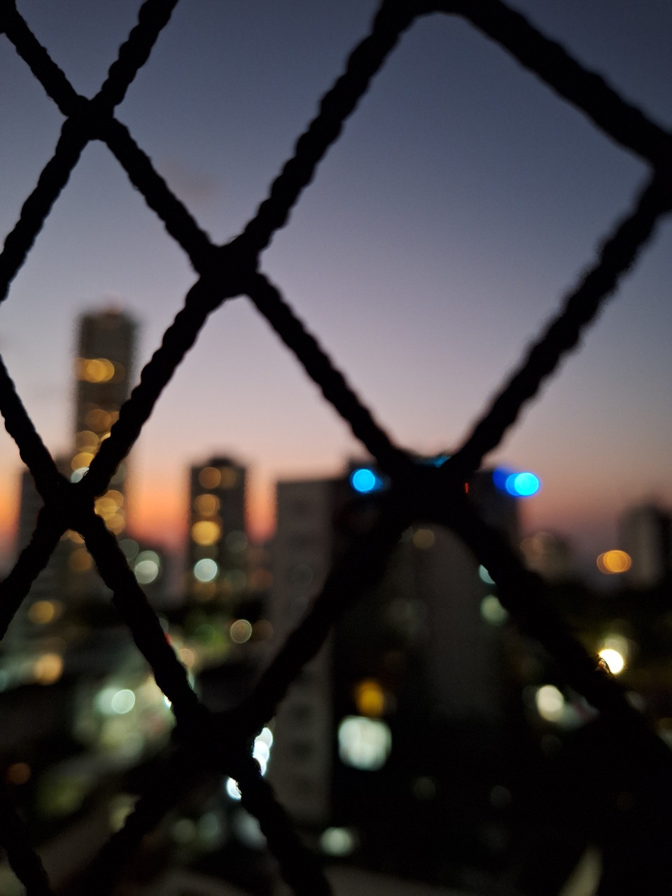
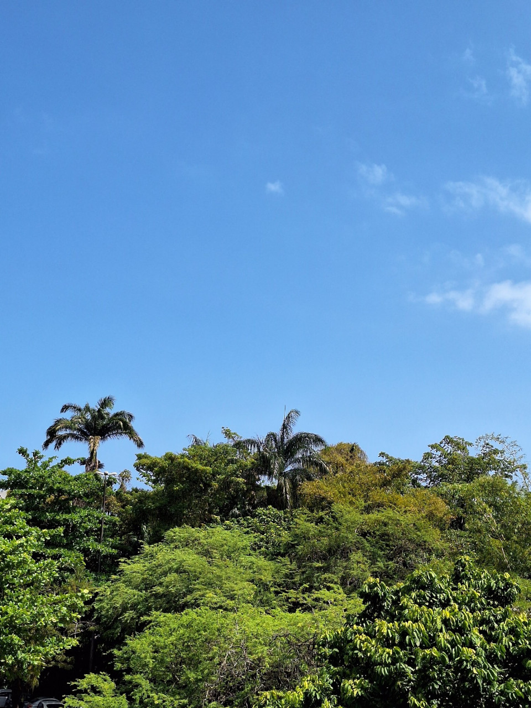

Literalmente apenas algumas fotografias que eu tirei usando o celular em algum momento no passado e quis repostar aqui. Como não tinha mais os arquivos originais, peguei do meu perfil no Bluesky e redimensionei, o que provavelmente explica os artefatos de compressão nas imagens.

Uma cerca de madeira rústica, com tábuas alinhadas, cercando um espaço ao ar livre.

Fotografia desfocada de uma cidade vista por uma tela em uma janela, destacando a paisagem urbana ao redor.

Céu azul limpo com poucas nuvens e várias árvores grandes, repleta de folhas verdes vibrantes.